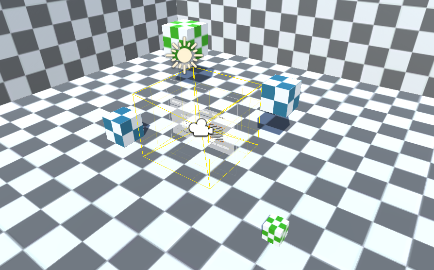

# Setup a CAVE Project from Scratch

## Easy Way
Open up the *Rig Builder* in the scene hierarchy context menu.
Make sure that all settings are correct and adjust when needed.
Now hit create and voilà your CAVE rig has been created automatically.
If you want to make sure that everything is setup properly click on every component and
look for missing references or warning / error boxes.
The components of the root *GameObject* should guide you to the settings your standalone build should have.
Warnings can be ignored as long as they do not affect your final build.
Now you are ready to finish your first CAVE scene. Go to the context menu again and
search for the *Hub* and click to complete the creation of the test scene.

Now run a standalone build for the x64 platform.

## Advanced Way
> **Note**: You should never use this way except you are trying to setup
a CAVE architecture which is completely different to the standard architectures.

Open up the scene hierarchy context menu and create a *Projector Brain*. This
*GameObject* will represent your CAVE. Now add a *Projector Mount* inside the
*Projector Brain*. Create a *Projector Emitter* for each projector in your CAVE.
The *Projector Mount* should be the parent of all *Projector Emitter*'s.
Next you need to create the *Projector Plane* for each *Projector Emitter*.
All *Projector Plane*'s should have the *Projector Brain* as parent.
Setup all references to the *Projector Plane* components inside the *Projector Emitter*'s.
To complete your projector rig you need to create *Projector Eyes* or attach them to a
empty *GameObject* inside the *Projector Brain*. Connect the *Projector Eyes* with the *Projector Mount*.
Your hierarchy should now look like this:
```
	o Projector Brain
			o Projector Eyes
			o Projector Mount
				o Projector Emitter
				o ...
			o Projector Plane
			o ...
```
The scene hierarchy is now completed and the next step is creating all required assets
including settings and configuration files.
For this step switch to the assets window and select the *Htw.Cave* namespace in
the context menu. Create one *Projector Settings* asset and a *Projector Configuration* asset
for each *Projector Emitter*.
Connect the *Projector Brain* with the *Projector Settings* and setup the references
for the *Projector Configuration* inside the *Projector Emitter* component.
Create a *Import Export System* if you want to load existing files and a *Joycon Manager*
if you need Joy-Con support.
For tracking capabilities attach a *Kinect Brain* to the *Projector Brain* and
a *Kinect Actor* plus a *Kinect Head* to the *Projector Eyes*.
Create the required settings files in your asset folder.
For a more features look into the *Htw.Cave* components. There you can find controllers, menus and more.
