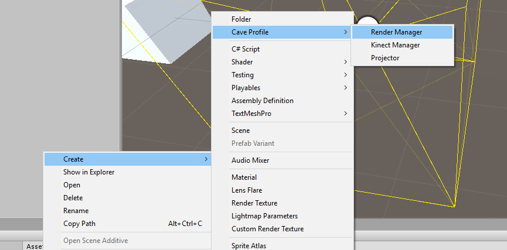

# Setup a project from scratch

## Profiles
The configuration is based on
[ScriptableObjects](https://docs.unity3d.com/ScriptReference/ScriptableObject.html).
Each configurable Behaviour references a special profile.
First of all you need to write down the architecture of your cave then you create
profiles accordingly to your architecture.

Profiles can be created by opening up the context menu of the folder which should
contain the profiles.

##### Projectors
For each projector in your cave create a `Projector Profile`.
Change the `Serialized Name` of the profile and leave the rest empty.

##### Render Manager
In order to get a stereoscopic effect and a holographic effect we need to setup
a `Render Manager Profile`. Leave it empty for now too.

##### Kinect Manager
To enable tracking in our environment create the `Kinect Manager Profile`.

## Scene Hierarchy
Our framework currently runs only on a single cave that is why you only need to
create a single empty GameObject which contains all of our cave logic called the `Cave Manager`.
The `Cave Manager` is made up of different behaviours and is the parent of all GameObjects that
interact directly with the cave.
The structure of your `Cave Manager` should look like this
```
Cave Manager
	Head
	Projector Mount
		Projector Emitter Front
		Projector Emitter Bottom
		...
	Projector Plane Front
	Projector Plane Bottom
	...
#####

```
>**Note**: If you want to know more about the different behaviours please take a
look at the code documentation.

##### Cave Manager
**Behaviours**
* Render Manager Initializer
* Render Manager Mono (optional)
* Render Manager Stereo (optional)
* Kinect Manager
* Profile Importer Exporter (optional)

##### Head
**Behaviours**
* Eyes

This object will be used to determine the eye positions for the stereo rendering
process inside the `Render Manager Stereo` or the mono rendering inside the
`Render Manager Mono`.

##### Projector Mount
**Behaviours**
* Projector Mount

Contains all `Projector Emitter` in the scene and should be following the tracked `Head`.

##### Projector Emitter ...
**Behaviours**
* Camera
* Screen Overlay
* Projector Emitter

Every single emitter renders a single display detail therefore need a camera.
The screen overlay removes all pixels not projected on the display.

##### Projector Plane ...
**Behaviours**
* Projector Plane

Defines the location and size of every display.
